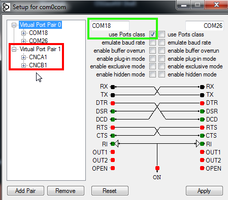

# Anytone D878 emulator

For analyzing the flash programming protocol a AT-D878UV radio emulator has been very useful. Instead of flashing real radio hardware you send your programming
data to the emulator script over a virtual null modem cable. The script will behave like the radio and simply acknowledges the packets to the programming software.

Instead of flashing a hardware the emulator will forward the programming data as hex strings to a server via a network connection. This is not mandatory,
you can run emulator and server on the same machine. Just use "localhost" as server name.

So instead of

```
Programming software <-> Anytone D878UV
                   COM10 via USB
```

you will have this scenario:

```
Programming software <-> virtual null modem cable <-> at_d878uv_emulator.py <-> LAN <-> at_d878uv_server.py
                    COM18                        COM26
```

The server will receive the programming data and stores each flash process in a seperate hex dump file. If one flash process ends it will automatically open
a diff tool (meld) and compare the stored files of the latest flash process and the one before. This lets you very efficiently analyse each byte of the 
flash process without using any hardware. Also wireshark to intercept the USB connection is not needed any longer. (The stored hex dumps files can be flashed later again using rewrite_hexdump.py.)


## Start Server 

```
python3 ./at_d878uv_server.py
```
By default the server uses /tmp as storage directory and "meld" as diff tool. You can change this in the config section in the server script. 
The server must be started before the emulator. Make sure you have write permissions in the storage directory. This script has not been tested on windows!


## Start Emulator

```
python3 ./at_d878uv_emulator.py Servername COM26
``` 

Servername can be "localhost" if its on the same machine. If you are using an other port in your virtual null modem cable than COM26 
make sure to adapt the port name to your settings.


## Virtual null modem cables

### Linux

```
socat -d -d pty,raw,echo=0 pty,raw,echo=0
```

### Windows

- e.g. com0com - https://sourceforge.net/projects/signed-drivers/ (http://com0com.sourceforge.net)
- From Windows 10 onwards you have to install the signed drivers.
- It might be necessary to deactive "secure boot" in the BIOS.
- **Remove default cable pair with CNCx1 port** (Anytone CPS has problems with alphanumeric port ids)
- Add pair e.g. COM18 - COM26
- Activate "use Ports class [x]" at least for port COM18 (otherwise CPS will not find it)



- Use COM18 in programming software
- Use COM26 on emulator side
